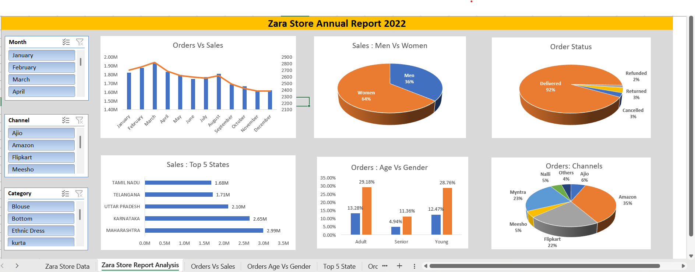
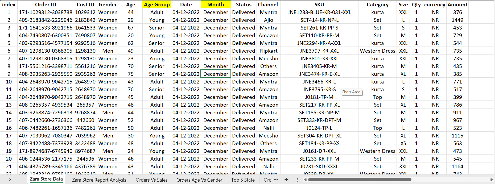

# Zara Sales Data Analysis

This project presents a detailed analysis of **Zara's sales performance** across multiple dimensions such as product category, customer demographics, sales channels, and regional trends. The dataset consists of multiple sheets, each focusing on specific analytical segments to highlight sales performance insights and business trends.

---

## 📊 Project Overview

The goal of this project is to explore Zara's sales data to identify:
- Key sales trends by **month, category, and region**
- Sales performance by **channel (e.g., Myntra, Zara.com, etc.)**
- Customer demographics including **gender, age, and age group**
- Product-related performance based on **category, size, and SKU**
- Order delivery performance and order status

---

## 🖼️ Dashboard Preview

Here’s a quick look at the analysis dashboards and visual insights generated from the sales data:

---

## 🧾 Dataset Description

Each sheet of the dataset covers different analytical perspectives derived from retail sales records.

### Columns Used
| Column | Description |
|--------|-------------|
| Order ID | Unique identifier for each customer order |
| Cust ID | Unique customer identifier |
| Gender | Customer gender (Male/Female) |
| Age | Age of the customer |
| Age Group | Customer segment classification (e.g., Teen, Adult, Senior) |
| Date | Order purchase date |
| Month | Month derived from the order date |
| Status | Current order status (Delivered, Shipped, Pending, etc.) |
| Channel | Sales platform used (e.g., Myntra, Zara.com, Flipkart) |
| SKU | Unique product code |
| Category | Product type (e.g., Kurta, Jeans, Dress, Shirt) |
| Size | Product size sold |
| Qty | Quantity ordered |
| Currency | Transaction currency (INR/USD/etc.) |
| Amount | Total amount of the order |
| Ship-City | Destination city |
| Ship-State | Destination state |
| Ship-Postal-Code | Shipping postal code |
| Ship-Country | Country of delivery |
| B2B | Binary field indicating business-to-business transactions |

---

## 🔍 Analysis Performed
- **Sales Trend Analysis:** Monthly and seasonal sales performance patterns.
- **Customer Segmentation:** Age and gender-based sales contribution.
- **Category Performance:** Best-selling categories and SKUs.
- **Channel Insights:** Comparison of performance across different sales channels.
- **Geographic Insights:** State and city-level sales distribution.
- **Order Fulfillment:** Delivery vs. pending rates and shipping analysis.

---

## 📈 Tools & Technologies
- **Excel / Power BI / Tableau:** For data cleaning and visualization  
- **Python (Pandas, Matplotlib, Seaborn):** For data manipulation and analysis  
- **SQL:** For querying and summarizing data  
- **GitHub:** Version control and portfolio presentation  

---

## 🗂️ Project Files
- `zara_sales_data.xlsx` — Raw and cleaned data with multiple analysis sheets  
- `zara_sales_analysis.ipynb` — Jupyter notebook with detailed analysis  
- `visualizations/` — Folder containing charts and dashboards  
- `summary_report.pdf` — Key insights and business conclusions  

---

## 🚀 Key Insights
- Women’s apparel contributed highest sales volume overall.  
- Peak sales observed during **December (Holiday Season)**.  
- Online channels like **Myntra** and **Zara.com** showed higher conversion rates.  
- Adult (25–44 years) customers accounted for majority of purchases.  

---

## 🧠 Future Enhancements
- Add **forecasting models** for monthly sales prediction.  
- Integrate **customer lifetime value (CLV)** and **churn analysis**.  
- Develop an **interactive dashboard** using Power BI or Streamlit.  

---

## 📬 Contact
Created by [Pawan Sharma]  
For questions or collaborations, connect on [1511pawankumar@gmail.com].
